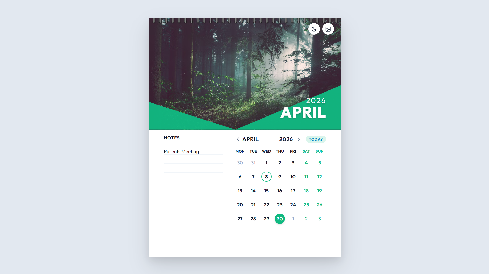
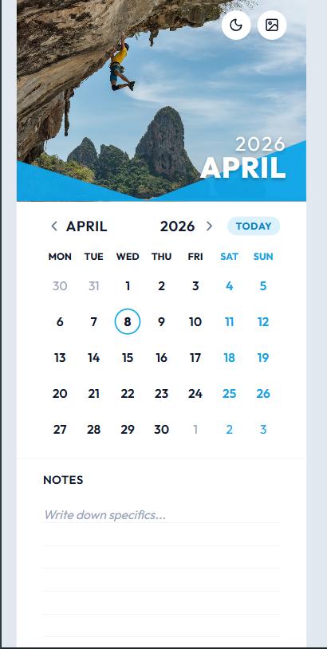

# Interactive Calendar Component

## Overview
This is my submission for the Frontend Engineering Challenge: building a highly functional, responsive interactive calendar. My goal was to create a component that feels like a physical wall calendar while maintaining the performance and flexibility of a modern web application.

Rather than relying on heavy UI frameworks, I built this from scratch using **Vite, React, and modular CSS**. This approach allowed me to maintain strict control over the responsive layout, micro-animations, and pure CSS state management.

## 🔗 Live Demo & Media

**🔴 Live Website:** [Click here to view deployed component](https://interactive-calendar-hari.vercel.app/)
**🎬 Video Walkthrough:** [Click to watch Loom video](https://www.loom.com/share/6beb8f1ec597433a8f712d069452e24e)

### Desktop / Tablet View


### Mobile Stacked View


## Architecture & Tech Stack
- **Framework**: React via Vite for a fast, purely frontend environment. No backend dependencies are used based on the prompt's scope.
- **Styling**: Pure CSS. I utilized CSS Variables for global theme management, Flexbox/Grid for component alignment, and `clip-path` math for the hero image masking.
- **Date Logic**: `date-fns`. Managing dates from scratch is prone to leap-year/timezone bugs, so I pulled in this lightweight utility to handle interval scaling and month validation safely.
- **State Management & Component Tree**: Built-in React hooks (`useState`, `useEffect`) govern the application entirely.
  - `App.jsx`: Acts as the global controller. It hoists the critical state (current theme, active month, selected date ranges) so it can cascade down as props.
  - `Hero.jsx`: Renders the visual anchor image based on the global array, responding to theme changes dynamically.
  - `DateGrid.jsx`: A self-contained module strictly handling the heavily mathematical 7-column flex generation matrix and bounding-box selections.
  - `Notes.jsx`: Captures input directly and independently syncs via unique payload strings keyed to the browser's `localStorage`.

## Challenges & Solutions

1. **Challenge:** Creating the physical "ruled paper" aesthetic for the notes section without relying on bloated image assets.
   **Solution:** I built a custom CSS `repeating-linear-gradient` aligned exactly with the `line-height` of a transparent, borderless `<textarea>`. This resulted in a perfectly scaling visual effect that mimics physical notebook paper entirely through math.

2. **Challenge:** Making the calendar usable and aesthetically pleasing across all screen formats (PC, Tablet, Mobile).
   **Solution:** I used a responsive Flexbox design. On wide screens, the application breaks into a side-by-side format (notes left, calendar right). Under `768px` (mobile/tablet vertical), the flex direction safely stacks vertically (Hero -> Calendar -> Notes) so touch-targets remain large and legible.

3. **Challenge:** Contextualizing user notes to specific dates using purely frontend technologies.
   **Solution:** I implemented a dynamic key-pairing algorithm tied natively to browser `localStorage`. Depending on whether a user selects a single day or highlights a range, the application generates a unique storage key string. This ensures notes are safely bound to the specific dates actively highlighted on the grid without needing a database!

## Bonus Features
- **Dark Mode**: A generic toggle that swaps root CSS attributes, converting the entire calendar's UI into a deep slate theme.
- **Dynamic Image Themes**: A cyclical state array that swaps the hero image, while subsequently updating the global `--primary` hex color variable to match the image's accent tone globally.
- **Holiday Recognition**: Included logic to parse standard holidays (e.g., Halloween, Christmas). They are marked with an indicator dot, and hovering on desktop triggers a custom, animated CSS tooltip containing the holiday name.

## Running Locally

1. Clone the repository and navigate into the folder:
   ```bash
   git clone <your-repo-link>
   cd interactive-calendar
   ```
2. Install the lightweight dependencies:
   ```bash
   npm install
   ```
3. Start the Vite server:
   ```bash
   npm run dev
   ```
Open `http://localhost:5173/` in your browser.
